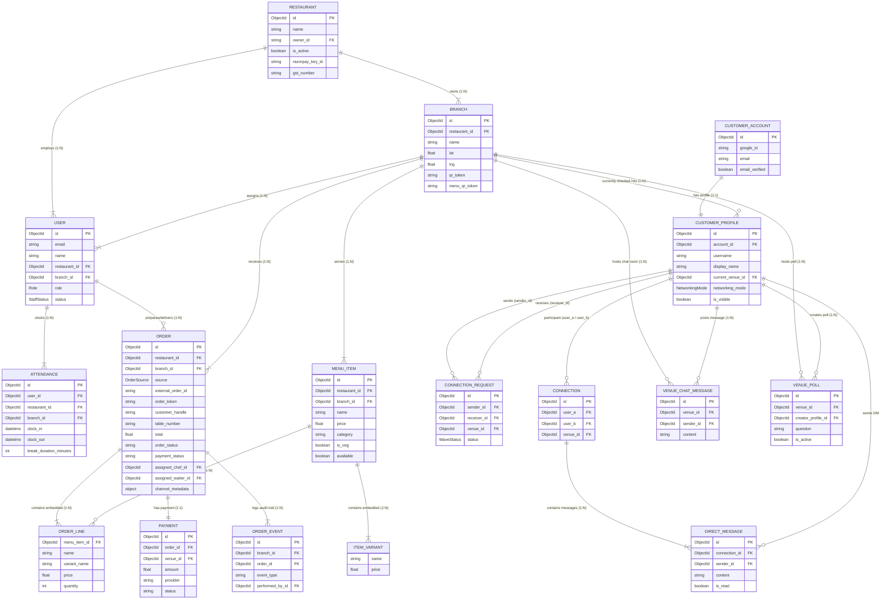

# Perch Application Model Entity Relationship Diagram (ERD)

This document maps out the complete **Entity-Relationship Diagram (ERD)** for the **Perch** application models. The database is organized into 5 primary domain clusters:

1. **Tenant & Venue Hierarchy** (Restaurant, Branch)
2. **Staff & Auth Domain** (User, Attendance)
3. **Menu Subsystem** (MenuItem, ItemVariant)
4. **Orders & Payments Subsystem** (Order, OrderLine, OrderEvent, Payment)
5. **Customer Networking & Chat Subsystem** (CustomerAccount, CustomerProfile, Connection, ConnectionRequest, DirectMessage, VenueChatMessage, VenuePoll)

---

## 1. Master System ERD Diagram

Below is the complete Mermaid ERD showing how entities are linked together through primary and foreign keys:

---

## 2. Model Relationship Breakdown by Domain

### A. Multi-Tenant Venue Hierarchy
* **`Restaurant` (1) $\rightarrow$ `Branch` (N)**: A single restaurant brand can operate multiple physical branches/venues.
* **`Branch` (1) $\rightarrow$ `User` (N)**: Staff members (managers, chefs, waiters) are assigned to specific branches.

### B. Kitchen & Order Execution
* **`Branch` (1) $\rightarrow$ `Order` (N)**: Orders are placed at specific venue branches.
* **`Order` (1) $\rightarrow$ `OrderLine` (N)**: Embedded list of purchased menu items inside the Order document.
* **`Order` (1) $\rightarrow$ `Payment` (1)**: Each order links to a transaction payment record (Razorpay, COD, etc.).
* **`Order` (1) $\rightarrow$ `OrderEvent` (N)**: Audit trail logging actions (e.g. `CHEF_ACCEPTED`, `WAITER_PICKUP`, `CASH_CONFIRMED`).

### C. Customer Presence & In-Venue Networking
* **`CustomerAccount` (1) $\rightarrow$ `CustomerProfile` (1)**: 1-to-1 account to public profile relationship.
* **`Branch` (1) $\rightarrow$ `CustomerProfile` (N)**: Tracks live customer check-ins via `current_venue_id`.
* **`CustomerProfile` $\rightarrow$ `ConnectionRequest` (Waves)**: Customer sends/receives wave connection requests inside a venue.
* **`Connection` (1) $\rightarrow$ `DirectMessage` (N)**: Once connected, two users exchange direct messages.
* **`Branch` (1) $\rightarrow$ `VenueChatMessage` (N)**: Public chat room for all customers checked into a specific branch.
